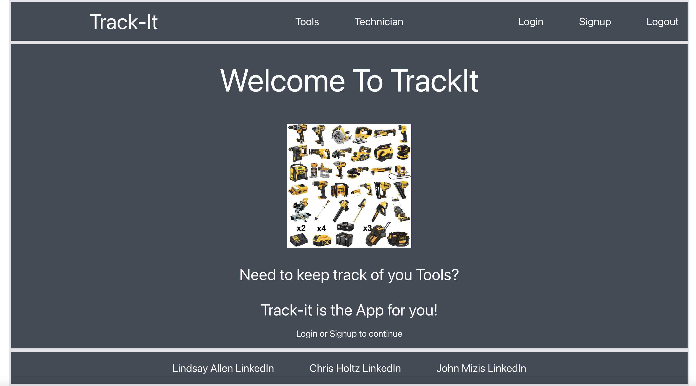
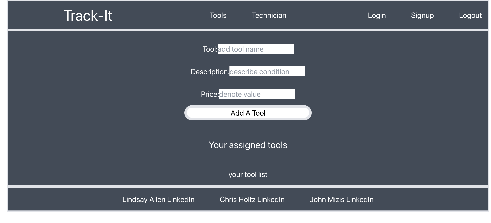

# TrackIt

*****
  

## Description
A compact business to business application that will keep track of inventory usage  across your company.
****
[TrackIt Live on Heroku](https://trackit-app.herokuapp.com/)
****

****
[Trackit Repository](https://github.com/jmizis/Project-3)
******
## Table of Contents
- [Description](#description)
- [Installation](#installation)
- [Usage](#usage)
- [License](#license)
- [Contributing](#contributing)
- [Tests](#tests)
- [Questions](#questions)
- [Sources](#sources)

*****

## Installation
[apollo-server-express @ 3.11.1](https://www.npmjs.com/package/apollo-server-express)

[bcrypt @ 5.1.0](https://www.npmjs.com/package/bcrypt)

[dotoenv @ 16.0.3](https://www.npmjs.com/package/dotenv) 

[express @ 4.18.2](https://www.npmjs.com/package/express) 

[graphql @ 16.6.0](https://www.npmjs.com/package/graphql)

[jsonwebtoken @ 8.5.1](https://www.npmjs.com/package/jsonwebtoken) 

[mongoose @ 6.8.1](https://mongoosejs.com/) 

[nodemon @ 2.0.20](https://www.npmjs.com/package/nodemon)

[jwt-decode @ 3.1.2](https://www.npmjs.com/package/jwt-decode)

[react @ 18.2.0](https://github.com/facebook/react/blob/main/CHANGELOG.md#1820-june-14-2022)

[react-dom @ 18.2.0](https://www.npmjs.com/package/react-dom?activeTab=versions)

[react-router-dom @ 6.2.1](https://www.npmjs.com/package/react-router-dom)

[react-scripts @ 5.0.1](https://www.npmjs.com/package/react-scripts)

[tailwindscss @ 3.2.4](https://tailwindcss.com/)

*****
## Usage
Using TrackIt, you can log the inventory being used by an employee and keep track of the items's age and usage. The future development usage is endless, creating user permissions, adding other inventory types to track and allowing user to create custom fields. 
****

*****
## License

[Open](https://wiki.creativecommons.org/wiki/Open_license#:~:text=An%20open%20license%20or%20free,use%20it%20how%20you%20want%22.)

This application is covered by the Open license. 
*****
## Contributing
John Mizis, Chris Holts, Lindsay Allen
*****
## Tests
n/a
*****
## Questions
please submit a pull request with any issues
*****
## Sources

*****

Find me on GitHub: [Katsaymeow](https://github.com/katsaymeow), [John Mizis](https://github.com/jmizis), [Chris Holts](https://github.com/clearbusinessinsight)

    